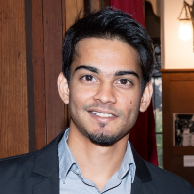
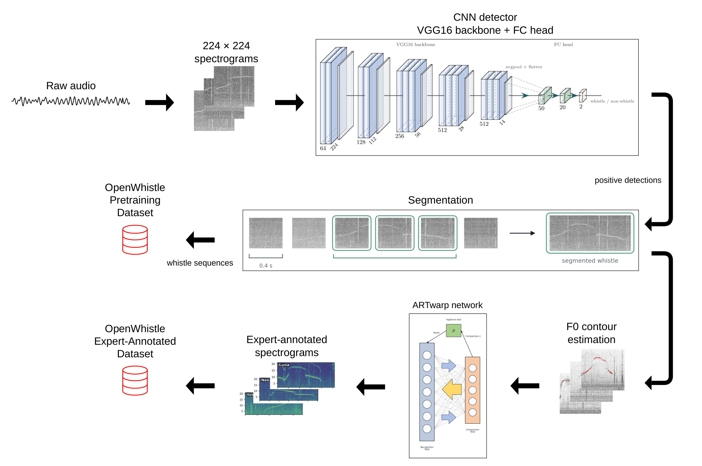
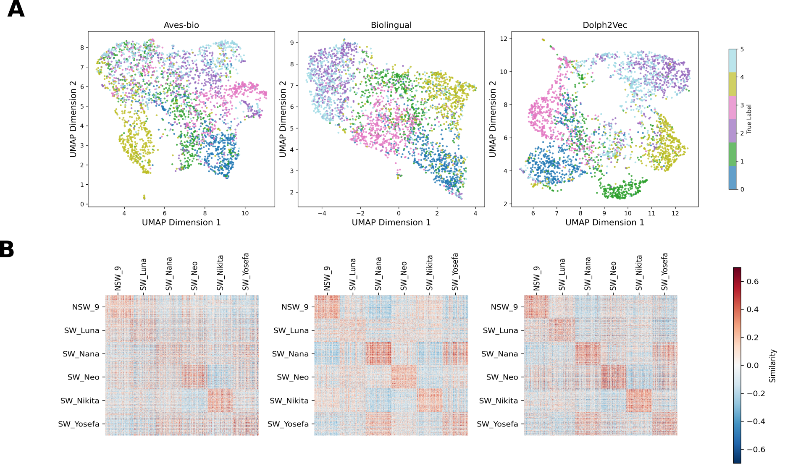
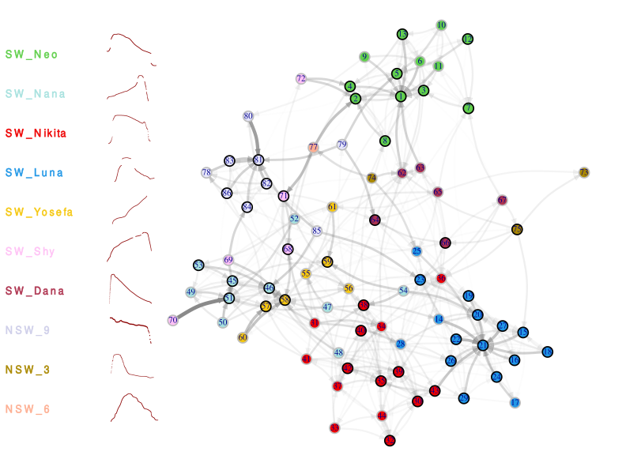

::: {.home-hero}

::: {.profile-card .profile-panel}

<h1 class="profile-name">Faadil Mustun</h1>

PhD Candidate · Univ. Paris Cité / ENS Paris

<nav class="contact-links" aria-label="Contact links">
<a href="mailto:faadilmustun@hotmail.fr" aria-label="Email"><i class="bi bi-envelope-fill"></i>Email</a>
<a href="https://scholar.google.com/citations?user=yCws0CEAAAAJ&hl=en" aria-label="Google Scholar"><i class="bi bi-mortarboard-fill"></i>Scholar</a>
<a href="https://github.com/fmustun" aria-label="GitHub"><i class="bi bi-github"></i>GitHub</a>
<a href="https://www.linkedin.com/in/faadil-mustun/" aria-label="LinkedIn"><i class="bi bi-linkedin"></i>LinkedIn</a>
</nav>

:::

::: {.about-panel}

## About

I am a PhD candidate at the Institut de Biologie de l'École Normale Supérieure (IBENS) and Université Paris Cité. I hold a Bachelor's degree in Mathematics from Université Pierre et Marie Curie and a Master's degree in Applied Mathematics (Statistics) from Sorbonne Université.

My research lies at the intersection of **bioacoustics, animal communication,** and **machine learning**. Using large-scale longitudinal acoustic datasets and self-supervised learning approaches, I investigate how dolphin vocalizations encode information about identity, social relationships, and interaction dynamics.

More broadly, I am interested in developing computational tools to uncover the principles underlying animal communication systems and their evolution. More recently, I have been contributing to the development of multimodal datasets combining acoustic recordings with behavioral annotations extracted from video data.

:::

:::

## News

<section class="news-list">

<article class="news-card">
  
24 Mar 2026

  <h3>Seminar presentation at IBENS</h3>
  
Presented my work at the Neurosection Department Seminar, Institut de Biologie, ENS Paris.

</article>

<article class="news-card featured">
  
03 Feb 2026

  <h3>Dolphin Spotting is live</h3>
  
Launched the citizen science project <a href="https://www.zooniverse.org/projects/sumbredolphin/dolphin-spotting">Dolphin Spotting</a> on Zooniverse to collect behavioral annotations from dolphin video recordings.

</article>

<article class="news-card featured">
  
12 Dec 2025

  <h3>Dolph2Vec accepted at NeurIPS workshop</h3>
  
Our paper <a href="#dolph2vec">Dolph2Vec</a> was accepted at the <a href="https://aiforanimalcomms.org">AI for Non-Human Animal Communication workshop</a> at NeurIPS 2025.

</article>

<article class="news-card">
  
14 Oct 2024

  <h3>Sharing dolphin communication research with the public</h3>
  
Presented our research on dolphin communication to the general public at the Fête de la Science in Paris.

</article>

<article class="news-card">
  
21 Mar 2023

  <h3>Guest lecture on dolphin communication</h3>
  
Gave a guest lecture on dolphin acoustic communication at Ben-Gurion University, Eilat Campus.

</article>

</section>

## Publications

::: {.columns .pub-card}

::: {.column width="30%"}

{width=100%}

:::

::: {.column width="70%"}

<h3>OpenWhistle: A Large-Scale Longitudinal Dataset and Benchmark of Bottlenose Dolphin Vocalizations Under review</h3>

**F. Mustun**, C. Semenzin (*equal contribution*), R. Dessì, P. Robin Guerrero, P. Orhan, A. Emanuelli, E. Rossi, Y. Lakretz, G. de Polavieja, G. Sumbre.

OpenWhistle introduces a large-scale longitudinal dataset of approximately 180,000 bottlenose dolphin whistles recorded over five years. The dataset includes expert annotations and benchmarks for whistle-type detection and classification, providing a resource for the development and evaluation of machine learning methods in dolphin bioacoustics.

::: {.pub-links}
[Preprint coming soon](#){.pub-button .secondary}
[Dataset coming soon](#){.pub-button .secondary}
[Code coming soon](#){.pub-button .secondary}
:::

:::

:::

::: {#dolph2vec .columns .pub-card}

::: {.column width="30%"}

{width=100%}

:::

::: {.column width="70%"}

<h3>Dolph2Vec: Self-Supervised Representations of Dolphin Vocalizations Workshop paper</h3>

C. Semenzin, **F. Mustun**, R. Dessì, A. Emanuelli, P. Orhan, Y. Lakretz, G. de Polavieja, G. Sumbre.

AI for Non-Human Animal Communication Workshop @ NeurIPS 2025.

Dolph2Vec is a self-supervised learning framework trained directly on dolphin vocalizations. The learned representations outperform general-purpose bioacoustic embeddings on dolphin-specific tasks and capture biologically meaningful acoustic structure.

::: {.pub-links}
[Paper](https://openreview.net/forum?id=QGAFX5kcR5){.pub-button}
[Code](https://github.com/chiarasemenzin/Dolph2Vec){.pub-button .secondary}
:::

:::

:::

::: {.columns .pub-card}

::: {.column width="30%"}

{width=100%}

:::

::: {.column width="70%"}

<h3>Whistle Variability and Social Acoustic Interactions in Bottlenose Dolphins Under review</h3>

**F. Mustun**, C. Semenzin (*equal contribution*), D. Rance, E. Marachlian, Z. Guillerm, A. Mancini, I. Bouaziz, E. Fleck, N. Shashar, G. de Polavieja, G. Sumbre.

This work shows that dolphin signature whistles exhibit structured within-individual variability rather than stereotyped production. By modeling transitions between whistle variants, we reveal non-random acoustic interaction patterns that form a modular social communication network.

::: {.pub-links}
[Preprint](https://www.biorxiv.org/content/10.1101/2024.10.15.618471v1){.pub-button}
[Code](https://github.com/zebrain-lab/Dolphins){.pub-button .secondary}
:::

:::

:::

## Selected Talks & Posters

::: {.talk-list}

::: {.talk-item}
::: {.talk-main}
### AI for Non-Human Animal Communication workshop <a class="talk-link" href="https://aiforanimalcomms.org" target="_blank" rel="noopener" aria-label="AI for Non-Human Animal Communication workshop link"><i class="bi bi-link-45deg"></i></a>

NeurIPS 2025, San Diego.
:::
::: {.talk-year}
2025
:::
:::

::: {.talk-item}
::: {.talk-main}
### Neurosection Department Seminar

Institut de Biologie, ENS Paris.
:::
::: {.talk-year}
2023–2026
:::
:::

::: {.talk-item}
::: {.talk-main}
### Protolang <a class="talk-link" href="https://sites.google.com/view/protolang8/home" target="_blank" rel="noopener" aria-label="Protolang link"><i class="bi bi-link-45deg"></i></a>

Rome.
:::
::: {.talk-year}
2023
:::
:::

::: {.talk-item}
::: {.talk-main}
### NeuroFrance

Lyon.
:::
::: {.talk-year}
2023–2024
:::
:::

::: {.talk-item}
::: {.talk-main}
### International Congress for Neuroethology

Lisbon.
:::
::: {.talk-year}
2022
:::
:::

:::

## Education

**PhD Student** — Université Paris Cité / École Normale Supérieure - Paris, 2022-Present

**Master’s Degree in Applied Mathematics (Specialization: Statistics)** — Sorbonne Universités - Paris, 2019

**Bachelor’s Degree in Mathematics** — Université Pierre et Marie Curie - Paris, 2016

## Research Experience

**PhD Candidate**, Institut de Biologie de l'École Normale Supérieure (IBENS), Université Paris Cité, Paris, France *(2022–Present)*  
Research on dolphin communication, bioacoustics, and machine learning.

**Statistical Engineer**, INSERM / IBENS, Paris, France *(2021–2022)*  
Developed computational methods for dolphin vocalization detection, classification, and sequence analysis.

**Data Science Intern**, Audentiel Conseil R&D, Boulogne-Billancourt, France *(2019)*  
Worked on hyperparameter optimization and machine learning model selection.
